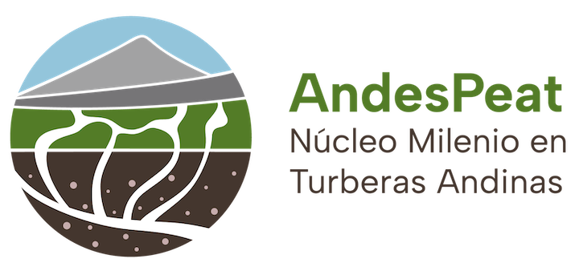
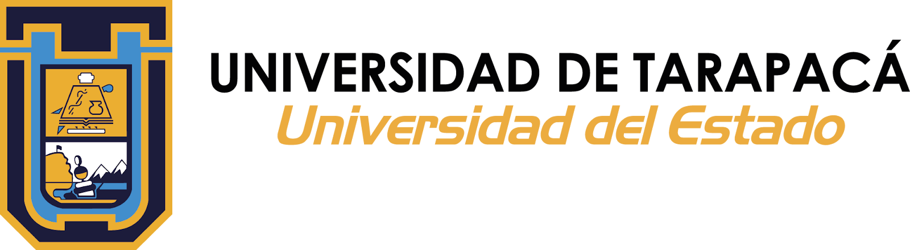
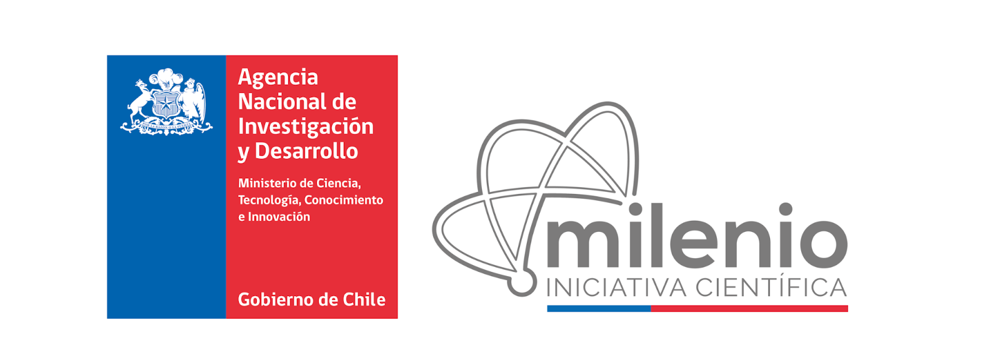

# Abstract {.unnumbered}

Bofedales, high-Andean peatlands located over 3,000m above sea level and formed from permanent water flow, are unique wetlands essential for water management, have a high cultural value for indigenous Aymara communities, and play a critical role in the global carbon system. While supervised machine learning algorithms have previously been used to analyze bofedales, unsupervised algorithms such as the k-means clustering algorithm have yet to be applied to the bofedales of Northern Chile. K-means finds distinctive groups of data points with similar values (called clusters) that naturally occur in the data. We applied a k-means algorithm to datasets consisting of 19 variables relating to a bofedal’s overall condition to determine whether the algorithm could reveal insights about a bofedal’s health. The variables ranged from climate factors such as precipitation and temperature to socioeconomic factors including mining sites and presence of nearby wells. Before running the algorithm, we ran Principle Component Analysis on the data, capturing 91.95% of the initial variance. We found k-means divides the bofedales of Northern Chile into eleven well-separated clusters, each with distinctive characteristics. We concluded that k-means is an effective algorithm to discover insights relating to bofedales’ health and the clusters it generates may be used to identify long-term trends in the health of these ecosystems. 

---

*This project is part of the Núcleo Milenio Andespeat, a research center funded by ANID and based at the Universidad de Tarapacá in Arica, Chile. It was developed by Estella Newton and advised by Manuel Prieto, Charlie Hoffs, and Francisco Mayol.*

{height=80px}
&nbsp;
{height=80px}
&nbsp;
{height=80px}