# Results & Analysis

By comparing results from the silhouette score, the Davies–Bouldin indicator, and the Calinski–Harabasz indicator we determined eleven clusters is the optimal k value. Running k=11 yielded the following clusters. Below, graphs demonstrate the characteristics of each cluster.

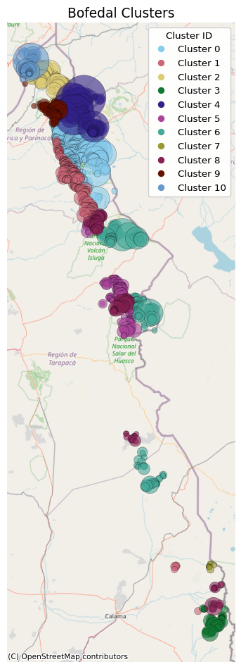{#fig-cluster-map height=600px}

In the above map, bofedales in each cluster are plotted geographically, with bigger points indicating bofedales with larger surface areas. Blank areas on the map were due to insufficient or vague data about the bofedales in those areas. Clusters 0, 2, 4, and 10 are located in the altiplano (highlands); clusters 1, 5, 6, 8, and 9 are precordillera (foothills); and clusters 3 and 7 are southern bofedales.

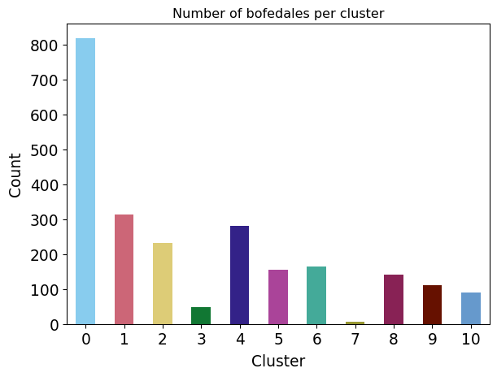{#fig-bof-distribution height=350px}

The number of bofedales per cluster varies widely. Cluster 0 accounts for 819 wetlands of the 2,372 sample while cluster 7 accounts for merely 8. Most clusters contain 100-300 bofedales.

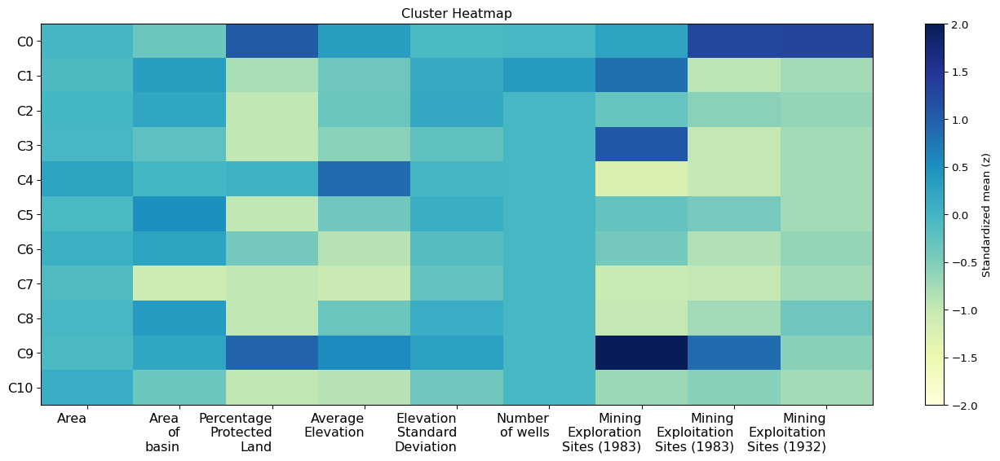{#fig-heatmap height=350px}

The heatmap shows the variance of each of the non-temporal variables. Darker blue squares indicate positive deviation from the mean and lighter yellow indicating negative deviation from the mean. The intensity of the color corresponds with the amount of variance. Certain variables have more or less variance across clusters; for instance, the mining variables have greater variance across the clusters, whereas area of each bofedal has a smaller variance.

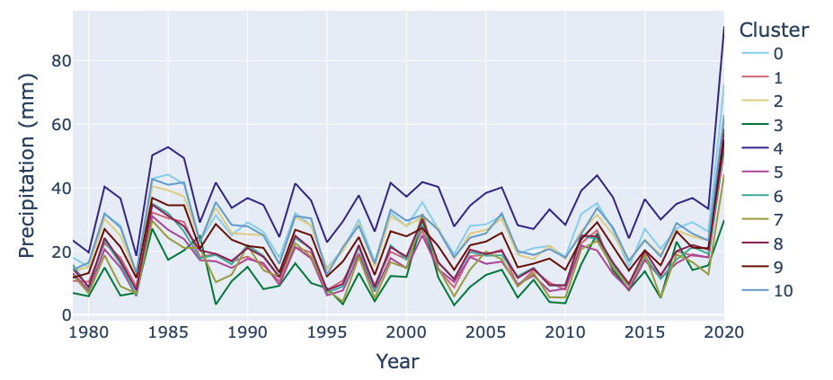{#fig-precip height=350px}

The highest precipitation cluster (4) is located at the highest elevation, while the next largest (0, 2, 10) are found in the altiplano. The second-lowest precipitation cluster (1, 5, 6, 8, 9) are precordillera, and southern groups (3, 7) have the lowest precipitation.

::: {.columns}
::: {.column}
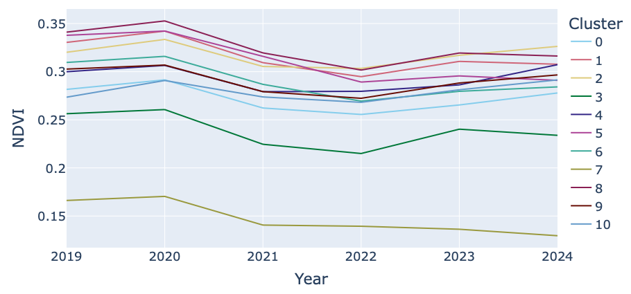{#fig-ndvi}
:::
::: {.column}
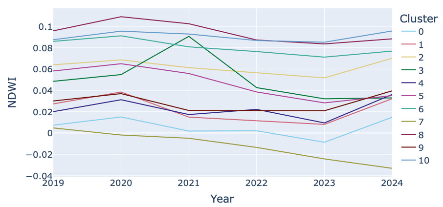{#fig-ndwi}
:::
:::

NDVI and NDWI are measurements taken from satellite imagery. NDVI is a measurement of greenery, with above 0.23 qualifying as a green or active bofedal, while below 0.23 is a dry vega. NDWI is a measurement of water in the imagery.

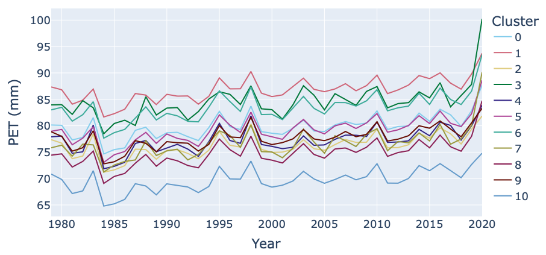{#fig-pet height=350px}

While all clusters trend upward, the atacama desert (3) and precordillera (1, 6) bofedales are much drier, and the altiplánico bofedales are in a moister environment.

::: {.columns}
::: {.column}
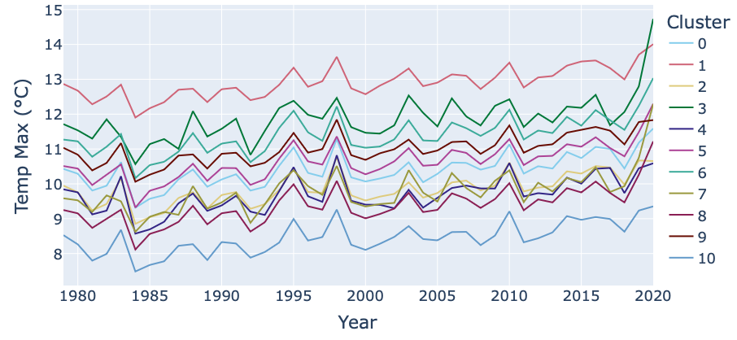{#fig-maxtemp}
:::
::: {.column}
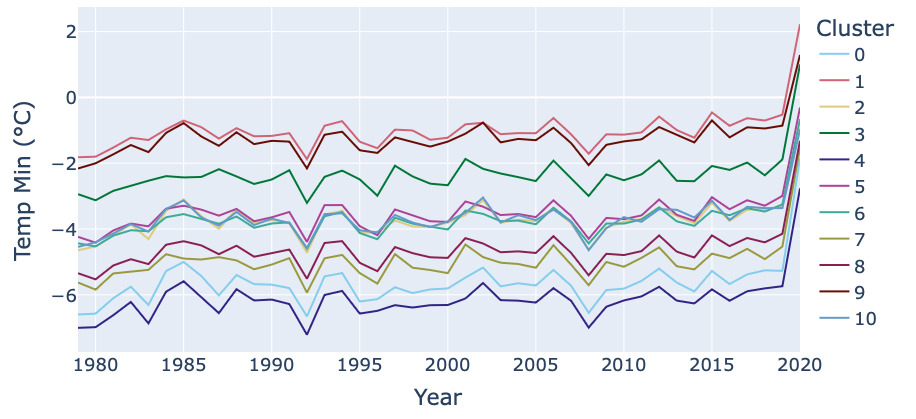{#fig-mintemp}
:::
:::

Higher bofedales (0, 4, 10) have consistently lower temperatures, but all clusters are experiencing a rise in temperature. Note: Average temperature data not avaliable on the CAMELS site at time of analysis.

::: {.columns}
::: {.column}
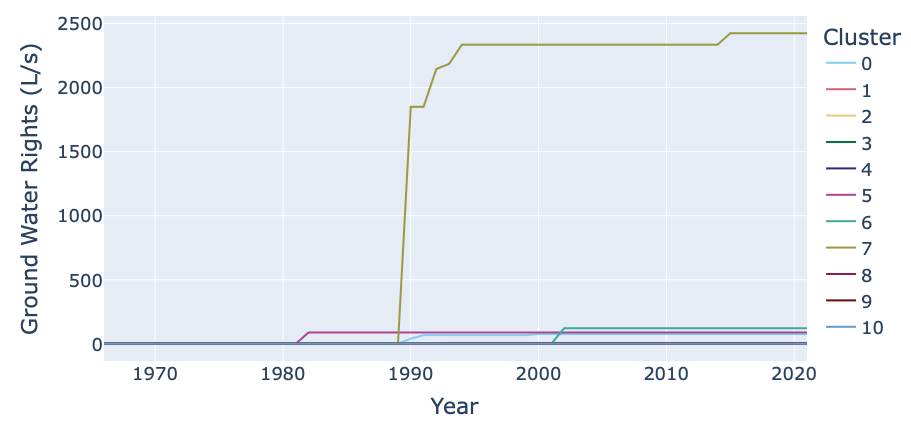{#fig-maxtemp}
:::
::: {.column}
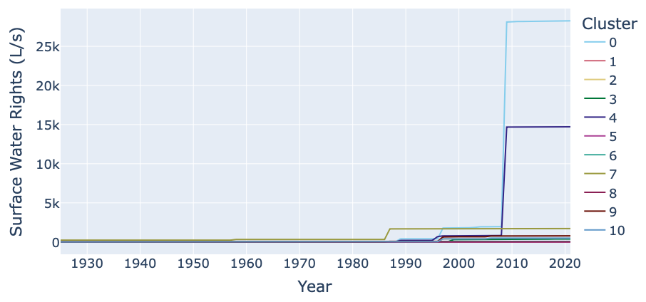{#fig-mintemp}
:::
:::

Groundwater extraction rights were low for most clusters, except for Cluster 7, consisting of small and dry southern bofedales, which spiked around 1990, almost reaching 2,500 L/s by 2020. Similarly, surface water extraction rights spiked for clusters 0 and 4 to 28,000 L/s and 15,000 L/s (respectively) but were low for the other clusters.

Overall, the clusters all have distinctive characteristics. Bofedales in similar locations (altiplánico, precordillera, and southern) generally have similar values for environmental variables. For multi-year temporal variables, clusters often, but not always, follow synchronous variability. Anomilies in these graphs are likely due to El Niño and La Niña events.

The next page contains a discussion of each cluster and its defining characteristics. 
